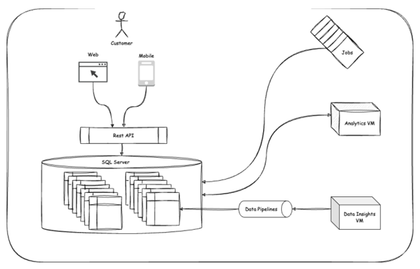
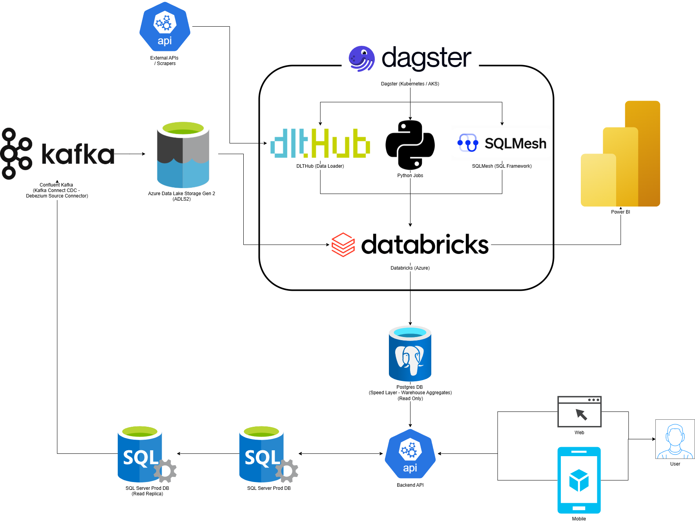

# **TransferRoom - Take Home** 
*(PDF Converted to Markdown)*

## Table of Contents
- [Current Architecture (Problems)](#current-architecture-problems)
  - [Analytics and Application Workloads](#analytics-and-application-workloads-on-same-database)
  - [Lack of Central Orchestrator](#lack-of-central-orchestrator)
  - [Lack of SQL Templating Framework](#lack-of-sql-templating-framework)
  - [No Consistent API Data Integration](#no-consistent-means-of-getting-api-data-into-warehouse)
  - [Lack of CDC Stream](#lack-of-cdc-change-data-capture-stream)
  - [Lack of Dedicated OLAP Database](#lack-of-dedicated-olap-database-warehouse)

- [Proposed Solution (Benefits)](#proposed-solutionbenefits)
  - [Separated Workloads (Read Replica + CDC)](#separated-application-workloads-and-analytics-workloads-read-replica--cdc-stream-via-kafka-connect--debezium)
  - [Dedicated OLAP Database (Databricks)](#dedicated-olap-database--warehouse-databricks)
  - [Central Orchestrator (Dagster)](#dedicated-central-orchestrator-dagster)
  - [SQL Transformation Framework (SQLMesh)](#sql-transformation--templating-framework-sqlmesh)
  - [Standardized API Data Process (DLTHub)](#standardised-process-for-pulling-in-api-data-and-pushing-to-warehouse-dlthub)
  - [Dedicated Analytics DB (Postgres)](#dedicated-analytics-db--speed-layer-for-fast-isolated-reads-of-metrics-postgres)
  - [Near Real-Time Capabilities](#near-real-time-capabilities-dagster--sqlmesh--databricks--postgres)

*Figure 1 TransferRoom Take Home – Current Architecture Diagram*

## **Current Architecture (Problems):**

* **Analytics and Application workloads on same database**
  * Large analytical queries should never take down the whole platform / DB or affect the natural running of the app where analytics are not relevant

* **Lack of central orchestrator**
  * This can make lineage hard to understand and often hurts debugging and discoverability
  * Alerting tends to be quite all over the place or more expensive to maintain

* **Lack of SQL Templating Framework**
  * This often leads to spurious DDLs, inconsistent write dispositions / methods (often leading to duplicates etc..), lineage issues, less testing, longer iteration cycles due to poor local development workflow etc...

* **No consistent means of getting API data into 'warehouse'**
  * Likely means time is wasted repeatedly trying to convert nested chunks of JSON into tables (and evolving the schemas, etc...) manually

* **Lack of CDC (Change Data Capture) stream**
  * **NOTE – CDC is basically a big log that shows when a table has had an insert, update or delete**
  * This effectively means that some amount of data is being continuously 'lost'. Specifically, knowing the exact state that a dimension table was at some given time rather than it's current state (e.g. user goes active, to inactive, back to active)
  * SCD-2 (slowly changing dimensions) are an important concept in data / analytics engineering which are tables specifically designed to allow analytics that may require knowing the state of a dimension at some given point in time like a user attribute (e.g. where they live)
  * It's possible that the analysts are taking snapshots of the table as an alternative which is ok, but this is not as reliable and can still result in data being lost. Having a CDC stream / copy means you can recreate the state of the DB at any point in it's history (from the day you start running it)

* **Lack of dedicated OLAP database (warehouse)**
  * OLAP databases store data in a columnar fashion rather than row based like OLTP ones (e.g. Postgres, MySQL etc...) which makes things like aggregations of large numbers of rows much faster
  * Backfilling, be it due to mistakes, changing a metric or wanting a new metric backdated, is an essential component of any data platform, and you want this to generally be as fast and easy as possible. Using an OLTP database means that this is generally going to take significantly longer which means it takes longer to fix production issues once the issue is found, and even longer if multiple runs are needed due to incorrect fixes
  * The slowness issue also affects local development as slower calcs mean that it is more likely for a dev to get distracted while waiting / find something else to do (this is very costly), and also that they will fundamentally have a longer time debugging
  * OLTP databases also tend to be less feature-rich from an analytics standpoint compared to OLAP databases (→ lost productivity for analysts / data engineers)

## Proposed Solution(Benefits):

*Figure 2 TransferRoom Take Home – Proposed Architecture Diagram*

#### ***Separated Application Workloads and Analytics Workloads (**Read Replica + CDC Stream via Kafka Connect / Debezium**)***

**1. Production DB Performance**
* The primary goal is to ensure the **main production database** functions solely as an **application DB**, minimising the risk of performance issues caused by analytics jobs
* Phase 2 could include investigating inefficiencies in API-to-database interactions (e.g., reducing multiple API calls into a single optimized query)

**2. Change Data Capture (CDC) Stream via Read Replica:**
* The **CDC process** should run on the **read replica** (database mirror) to avoid stressing the production DB.
* CDC logs (or transaction logs used for CDC tables) are typically retained for **3-7 days**, so a system must **continuously read and store** them elsewhere in a **cheaper storage format**

**3. Tool Choice:**
* **Debezium (via Kafka Connect)** is the most well-known tool for this purpose
* **Managed Kafka (Confluent Cloud)** has been picked instead of self-hosting Kafka, as it's more reliable and cost-effective for this specific use case
* **Kafka Connect** enables smooth data transfer from the source (SQL Server) to a target system
* Alternatives Considered:
  * **Estuary (SaaS product)** – Possibly a good option, but have concerns about company size/reliability. Worth reconsidering only if Confluent Cloud is too expensive
  * **Azure Data Factory (ADF)** – Might support this, but reliability is a concern. We may test it in the future, but for now, would want to prioritize proven, stable solutions to avoid data loss risks.
* Alternatives like **AWS DMS** and **Estuary** exist, but Debezium remains the most proven solution (and the first one isn't an option anyway as we are on Azure)

**4. Storage Format Considerations:**
* Data will be stored in **Azure Data Lake Storage (ADLS2)** in **Parquet format**.
* **Why Parquet?**
  * It's a **columnar storage format**, offering:
    * **High compression** (efficient storage)
    * **Fast reads & loads** (ideal for data warehouses)
    * **Great support** (due to being industry standard)
* Once in ADLS2, data can easily be used by **Databricks** (which natively integrates with ADLS2) or most modern execution engines for that matter

**5. Storage Format Considerations:**
* This setup can be done **entirely via the UI (on Confluent Cloud)**, making deployment straightforward

#### ***Dedicated OLAP Database / Warehouse (**Databricks**)***

**1. Tool Choice:**
* **Databricks** has strong **Azure integration** and often gets **priority access to new features**
* **Snowflake** is great for **multi-cloud** environments but doesn't have the same deep Azure integration
* **Azure Synapse** is another option but is generally considered a **weaker version / knock-off of Databricks**, so it's not being considered
* **BigQuery** (GCP-based) is excellent but **not relevant** for this setup
* BigQuery Omni exists but lacks key features, so it's not a better option

**2. Databricks Usage Philosophy:**
* Even though **Databricks has many features**, it's best for us to **use as few features as possible**
* **Primary use case:** **SQL data warehouse** with occasional **ML workloads in PySpark** when needed

**3. Data Lakehouse & Access Control (Unity Catalog):**
* **Unity Catalog** is the **schema and access control layer** for data stored in **Azure Data Lake Storage (ADLS2)**
* **How it works:**
  * Acts as an **abstraction layer** over **blob storage**, making it behave like a traditional warehouse
  * Uses **Delta Lake** (Databricks' ACID-compliant table format) to maintain **reliability** over raw **Parquet files**
  * **Growing support for Iceberg** (due to Tabular Acquisition), but **Delta Lake remains a 1st class citizen**

**4. Performance & Scalability Considerations:**
* **ShellCorp's expected data size** is likely in the **terabytes (TBs)**, not **petabytes (PBs)**
* This means that **standard best practices** should be enough to ensure **strong performance**
* Unlike **PB-scale setups**, **no extensive tuning** should be needed, so **setup and deployment will be quick**

#### ***Dedicated Central Orchestrator (Dagster)***

**1. Avoid No/Low-Code:**
* Azure Data Factory (ADF) and other no/low-code pipeline tools (e.g., Databricks Workflows, Snowflake Tasks etc...) can be fine in certain situations, especially when a company has limited data engineering expertise
* However, service-native workflow tools tend to be limiting in areas such as:
  * Testing capabilities
  * Alerting flexibility
  * Dynamically created DAGs
  * Data catalog integrations
  * Etc...

**2. Tool Choice:**
* **Airflow** is the older market leader, but **Dagster** has gained strong momentum due to its modern approach
* From experience, **Dagster** has proven to be an excellent orchestration tool, offering:
  * **Customizable alerting**
  * **Dynamic DAG structures**, useful for:
    * APIs
    * Looping over database tables
    * Custom/unsupported integrations
  * **Global asset lineage**
    * Supports manual runs based on lineage, similar to DBT's asset+ syntax (run asset plus all child dependencies)
  * **Metadata & Repository Integration**
    * Publish metadata such as owners, descriptions, and group names
    * Custom-built tools can:
      * Emit metadata & lineage for all assets/classes used
      * Use LLMs to prevent code drift (e.g., automatically generating documentation, column descriptions)
  * **Local Testing & Cost Control**
    * Test workflows locally without hitting Databricks or incurring costs
    * Use configs to scale up/down resources easily
    * Perform unit tests before running full jobs
  * **First-Class Support for Asset/Data Quality Checks**
  * **Reusable Utility Functions**
  * **Supports Lightweight Python Jobs**
    * Great for tasks like OpenAI calls or small data transfers
    * Avoids unnecessary Databricks cluster usage, allowing full control over memory and compute allocation (just a function decorator needed)
  * **Replaces Non-Application related Jobs in Azure**
  * **Excellent Support for DBT / SQLMesh**

**3. Deployment Strategy:**
* Dagster will be deployed via **AKS** (Azure Kubernetes Service)
* Dagster Cloud is being ignored as it is a bit of a rip-off unfortunately

#### ***SQL Transformation / Templating Framework (SQLMesh)***

**1. Why use a SQL templating framework?**
* **More Accessible for Analytics Engineers:**
  * SQL is more widely known than Python/PySpark, making it easier for BI analysts to contribute
  * Python models can still be used when PySpark is necessary
  * Onboarding new hires is easier since many have experience with DBT
* DBT is largely industry standard these days (SQLMesh is just a newer alternative with some benefits that I will outline later)
* **Improved Local Development Workflow:**
  * Allows basic orchestration of SQL models (tables) without needing to spin up expensive or slower environments (e.g., Databricks, Dagster)
  * Faster iterations on code
* **First-Class Support for Unit Tests & Data Quality Checks:**
  * Data quality checks are already strong in Dagster, but unit testing SQL is often neglected—this helps enforce best practices
* **Community-Made Extensions & Integrations:**
  * Popular DBT extensions (e.g., dbt-utils, dbt-expectations) simplify data quality checks and macros
* **Enforces Standardization:**
  * Helps prevent inconsistent SQL/PySpark implementations
  * Improves lineage tracking for transformations

**2. Why SQLMesh > DBT?**
* **DBT Core Has Become Stagnant:**
  * Since DBT's large VC funding rounds ($200M Series D), innovation has slowed, and many features are now locked behind their expensive cloud offering
  * SQLMesh, though also VC-backed, has less funding pressure ($20M Series A) and is actively solving major DBT pain points
* **Python Macros Instead of Jinja Macros:**
  * DBT only supports Jinja macros, which lack proper testing and type support
  * SQLMesh allows Python macros, which can be type-hinted and tested, making them more reliable for complex pipelines
* **SQL Checks at Compile Time:**
  * SQLMesh understands SQL natively, allowing it to check for errors without hitting the data warehouse
  * This saves money and is much faster than sending queries to the warehouse
* **First-Class Unit Testing:**
  * SQLMesh executes unit tests with DuckDB, avoiding unnecessary warehouse queries
  * Even CTEs (Common Table Expressions) can be tested independently
* **Native Table Diffing (Prod vs. Dev):**
  * Compare dev vs. prod data using a simple CLI command
  * Makes it easy to see how changes will affect production (normally a painful manual process)
* **Automated Detection of Breaking vs. Non-Breaking Changes:**
  * Similar to Terraform, SQLMesh detects whether a change is breaking or non-breaking
  * Helps answer:
    * Do we need to backfill this metric?
    * Do downstream models need to be rerun?
* **Native Batching & Start Date Support:**
  * SQLMesh allows defining batch sizes (e.g., 7 days) for backfills, preventing resource overload from massive queries
  * Start dates improve code hygiene, clarifying when data is trusted/usable
* **Partition Awareness:**
  * SQLMesh tracks filled vs. missing partitions, reducing the risk of data gaps in tables
* _(There are many other benefits, but these highlight why SQLMesh is a strong alternative to dbt)_

**3. Business Logic & Data Architecture**
* The **medallion architecture** (bronze → silver → gold) would likely be followed:
  * **(Bronze) Raw layer** → Direct data ingestion
  * **(Silver) 1+ staging layers** → Data cleaning, transformation
  * **(Gold) Mart layer** → Final business logic layer

#### ***Standardised Process for Pulling in API Data and Pushing to Warehouse (DLTHub)***

**1. Why Standardize API Data Ingestion?**
* Many API sources need to be integrated, and having a consistent method for:
  * Fetching API results
  * Handling schema evolution
  * Managing write disposition
  * Generating warehouse-specific DDL
* A standardized approach reduces effort when adding new data sources

**2. Why Use DLTHub?**
* **Lightweight Python Library** → Makes API ingestion simpler & more efficient
* **Huge efficiency gains** → Helped delete 7 AWS services (Glue Crawler, Glue Jobs, AWS DMS, and Airbyte) in a month at my current job
* **Prebuilt "verified connectors"** → Similar to Shadcn UI, but for data pipelines & API sources:
  * Many common APIs have ready-to-use connectors (just copy-paste into your repo)
  * For unsupported APIs, DLTHub provides helper utilities that make calling APIs and handling data trivial
* **Automated Features:**
  * Handles paginated JSON responses
  * Infers data types automatically
  * Manages nested JSON (configurable)
  * Controls write disposition (e.g., insert+delete updates)
* **NOTE** – This tool is not 100% necessary, but it's a light abstraction that saves time and effort. Since it streamlines API ingestion significantly, there's no reason not to use it.

#### ***Dedicated Analytics DB / Speed Layer for Fast, Isolated Reads of Metrics (Postgres)***

**1. Why Not Use the Data Warehouse for Application Queries?**
* Using the data warehouse (Databricks) as a backend for the application would be:
  * Too expensive
  * Too slow (high latency)
* Instead, a dedicated analytics DB can be used to serve pre-aggregated metrics quickly to the application

**2. How this Works**
* A job in **Dagster** will regularly copy all business (gold) layer tables/views into a separate **Postgres** database (dedicated for this purpose)
* The application will have **read-only access** to this Postgres database
* **Benefits of this Approach:**
  * **Safer & More Controlled Data Access:**
    * The analytics DB only allows reads, preventing accidental data modifications
    * Ensures a consistent, controlled write rate into Postgres
    * Heavy computation is done in Databricks beforehand, keeping Postgres lightweight
  * **Performance & Cost Efficiency:**
    * Warehouse (Databricks) does the heavy lifting → Postgres is used only for fast queries
    * Keeps application queries cheap and responsive

**3. Alternative Tool Choices**
* **SQL Server** – Could also be used instead of Postgres with no major issue
  * Downside is losing the ability to use Postgres extensions like pgvector that allow for embeddings and vector search
* **ClickHouse** – Would be a good option for large-scale, high-granularity filtering, but isn't necessary at this point
  * Best to start with Postgres, then upgrade only if needed
* **Cube.dev** – This is like the data models in Power BI or Looker but isn't tied to any single BI tool. It sets up how your tables relate to each other and uses strong caching, so you can quickly slice and dice your data
  * This setup is great for AI applications because it reduces the chance of getting incorrect metrics. Think of it as an auto-generated API with clear descriptions for metrics and data details, ensuring you get accurate, vetted information. This is a step up from Text-to-SQL models, which almost always produce unreliable results with boundless possibilities to be wrong in ways that are not obvious (and may have no business relevance)
  * Cube would introduce some complexity, and I haven't used it before, but it seems promising. It might be worth exploring in the future, especially after we've tackled our current issues. Plus, with Cube, both Power BI and our web back-end could use the same API and data model, keeping everything consistent
  * There are other more basic steps you can take toward consistency (e.g. using wide tables in the data warehouse 'gold' layer), so this is not essential, but is something worth noting

#### ***Near Real-Time Capabilities (Dagster + SQLMesh + Databricks + Postgres)***

**1. Suitability for ~10-Minute Latency**
* If **near real-time updates** (~10 min latency) are required, this architecture can support it efficiently
* While DBT could handle this, **SQLMesh's automatic partition tracking** simplifies incremental processing
* In Dagster, a simple job scheduled every 10 minutes can trigger all SQLMesh-managed tables, followed by the Postgres copy as the final step
* **Key Requirement:**
  * Everything must be processed in **incremental chunks** (i.e., no full refreshes) to avoid exceeding the 10-minute window

**2. Workflow Breakdown**
* **MERGE Statements for CDC Log Tables (First Step of the Job):**
  * Ensures that all Change Data Capture (CDC) log tables contain active versions of each table
  * SCD-2 tables (slowly changing dimensions) also need to be processed
  * These tables act as the raw data sources for SQLMesh
* **An alternative:**
  * The raw tables could be updated in real-time instead (either using spark structured streaming or streaming tables)
  * This might incur slightly higher costs, but the difference vs. running every 10 min is unclear (may be about the same cost)
* **SQLMesh Handles Incremental Processing:**
  * SQLMesh ensures that only new partitions are processed, preventing unnecessary re-computation
* **Postgres Copy (Final Step of the Job):**
  * After transformations, results are pushed to Postgres for fast, isolated reads by the application

**3. Handling Actual Real-Time Requirements (<1 Minute)**
* If **true real-time tables** are needed, the best option is **Databricks Streaming Tables**
* **Potential Issues:**
  * Higher costs (since it would require leaving a Databricks cluster running)
  * Databricks acting as a partial backend, which may not be desirable
  * Streaming tables have some limitations and can be tricky for specific use cases
  * Micro-batching (~10 min updates) is simpler and likely sufficient for most use cases
  * Unless strictly required, full real-time streaming should be avoided due to its complexity and cost implications